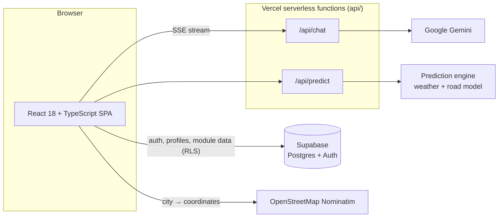

<div align="center">


# Logintel

**AI-powered logistics intelligence for fleet managers and freight forwarders.**

Weather-aware route delay predictions, fleet and delivery analytics, EU compliance tracking, route profitability and carbon reporting, all behind a single conversational assistant.

[](https://react.dev)
[](https://www.typescriptlang.org)
[](https://vitejs.dev)
[](https://tailwindcss.com)
[](https://supabase.com)
[](https://vercel.com)
[](LICENSE)

[Features](#-features) · [Architecture](#-architecture) · [Getting started](#-getting-started) · [Configuration](#-configuration) · [Project structure](#-project-structure) · [Scripts](#-scripts)

</div>

---

## ✨ Features

Logintel is organised into six *Intelligence* modules plus a conversational assistant. Every module ships with a demo dataset, so the whole product can be explored without a backend.

| Module | What it does | Pages |
| --- | --- | --- |
| 💬 **Logistic Intelligence** (Chat) | Streaming AI assistant specialised in European road transport. Suggests the right module for each question, keeps conversation history locally. | Chat |
| 🗺️ **Route Intelligence** | Weather-aware delay predictions for a single trip, weekly departure planning, route comparison, ETA reports and prediction history. Results are drawn on an interactive Leaflet map with per-segment risk. | Single prediction · Weekly plan · Compare routes · ETA report · History |
| 🚚 **Fleet Intelligence** | Fleet overview, predictive maintenance alerts, vehicle allocation, operational cost tracking and document expiry monitoring. | Overview · Maintenance · Allocation · Costs · Documents |
| 📦 **Delivery Intelligence** | Delivery performance KPIs, active shipment tracking, delivery windows, customer notifications and ETA accuracy. | Performance · Tracking · Windows · Notifications · Accuracy |
| 🛡️ **Compliance Intelligence** | EU driving-hours limits, tachograph data, licences and documents, ADR dangerous-goods shipments and compliance reports. | Driving hours · Tachograph · Documents · ADR · Report |
| 💶 **Finance Intelligence** | Route margins, cost analysis, client profitability, budget forecasting, penalties and billing. | Margins · Costs · Profitability · Budget · Penalties |
| 🌱 **Carbon Intelligence** | CO₂ per route and per vehicle, ESG reporting, emission optimisation and historical trends. | Routes · Vehicles · ESG · Optimisation · History |

### Platform capabilities

- **Credit-based usage model.** Each action has an internal credit cost (see `src/lib/creditCosts.ts`). Plans define a daily allowance that resets every day, plus purchasable extra credits.
- **Demo mode.** Open the app with `?demo=true` (or use the "view the demo" link on the login page) to explore every module with mock data and a local credit balance, no account needed.
- **Authentication.** Email + password and Google OAuth through Supabase Auth, with "remember me", password reset, profile management and account deletion.
- **Settings.** General preferences, profile, notifications, plan and credits, API key, team and billing.
- **Dark UI** built with Tailwind CSS, an emerald / cyan accent palette and the Outfit and JetBrains Mono typefaces.

---

## 🏗 Architecture



- **Frontend** is a single-page app. State lives in a small Zustand store for auth and in local component state elsewhere. Data access goes through typed service modules in `src/services/`, one per domain.
- **Serverless functions** keep secrets off the client. `api/chat.ts` proxies Google Gemini and streams tokens back as Server-Sent Events. `api/predict.ts` forwards prediction requests to the external prediction engine with the server-side API key.
- **Local development** does not need Vercel: a small Vite plugin in `vite.config.ts` serves the same two endpoints from the dev server, reading keys from `.env`.
- **Database** schema, row-level-security policies and triggers live in `supabase/schema.sql`. Every table is scoped to the authenticated user.
- **Transactional email** is handled by a Supabase Edge Function (`supabase/functions/send-email`) backed by Resend.

---

## 🚀 Getting started

### Prerequisites

- Node.js 18 or newer
- npm 9 or newer

### Install and run

```bash
git clone https://github.com/peppeneglia/logintel-app.git
cd logintel-app
npm install
cp .env.example .env      # fill in the values you have (all optional for demo mode)
npm run dev
```

Open <http://localhost:5173/?demo=true> to explore the product with mock data.

### Run against real services

1. Create a Supabase project and run `supabase/schema.sql` in the SQL editor.
2. Enable Email and (optionally) Google providers under *Authentication → Providers*.
3. Put the project URL and anon key in `.env` as `VITE_SUPABASE_URL` and `VITE_SUPABASE_ANON_KEY`.
4. Add a Google Gemini API key as `GEMINI_API_KEY` to enable the chat assistant.
5. Add `RAILWAY_API_URL` and `RAILWAY_API_KEY` to enable live route predictions.
6. Optionally deploy the email function:

   ```bash
   supabase functions deploy send-email
   supabase secrets set RESEND_API_KEY=re_xxxxxxxx
   ```

---

## ⚙️ Configuration

All configuration is done through environment variables. Copy `.env.example` to `.env`; the file is git-ignored.

| Variable | Scope | Required | Description |
| --- | --- | --- | --- |
| `VITE_SUPABASE_URL` | Browser | For auth and persistence | Supabase project URL |
| `VITE_SUPABASE_ANON_KEY` | Browser | For auth and persistence | Supabase anonymous (public) key. Safe to expose; access is enforced by RLS. |
| `GEMINI_API_KEY` | Server | For chat | Google Gemini API key |
| `GEMINI_MODEL` | Server | No | Gemini model id. Defaults to `gemini-2.5-flash`. |
| `RAILWAY_API_URL` | Server | For predictions | Base URL of the prediction engine |
| `RAILWAY_API_KEY` | Server | For predictions | API key sent as `X-API-Key` to the prediction engine |

Variables prefixed with `VITE_` are bundled into the client. Everything else is read only by the serverless functions (and by the Vite dev middleware locally), so it never reaches the browser.

### Deploying to Vercel

Import the repository in Vercel, add the server-side variables above in *Project → Settings → Environment Variables*, and deploy. `vercel.json` already configures the SPA rewrite and the function timeout.

---

## 📁 Project structure

```
logintel-app/
├── api/                        # Vercel serverless functions
│   ├── chat.ts                 #   Gemini proxy with SSE streaming
│   └── predict.ts              #   Prediction engine proxy
├── public/                     # Static assets (favicon)
├── src/
│   ├── app/                    # App shell: routes, layout, header, sidebar
│   ├── components/             # Shared UI: modals, map, form fields, badges, toasts
│   ├── data/                   # Mock datasets used in demo mode
│   ├── features/               # One folder per product module
│   │   ├── auth/               #   Login, register, reset password, route guard
│   │   ├── chat/
│   │   ├── route-intelligence/
│   │   ├── fleet-intelligence/
│   │   ├── delivery-intelligence/
│   │   ├── compliance-intelligence/
│   │   ├── finance-intelligence/
│   │   ├── carbon-intelligence/
│   │   ├── notifications/
│   │   └── settings/
│   ├── hooks/                  # useCredits, useToast, useUnavailable
│   ├── lib/                    # Supabase client, credit costs, validation, constants
│   ├── services/               # Typed data-access layer (one module per domain)
│   ├── stores/                 # Zustand auth store
│   └── types/                  # Domain types and generated Database types
├── supabase/
│   ├── schema.sql              # Tables, RLS policies, triggers
│   └── functions/send-email/   # Edge Function for transactional email (Resend)
├── vercel.json                 # SPA rewrites and function config
└── vite.config.ts              # Vite config + local /api middleware for development
```

Each feature folder follows the same convention: a `components/` folder with the module page (tabs and layout) and a `pages/` folder with one file per tab.

---

## 🧰 Scripts

| Command | Description |
| --- | --- |
| `npm run dev` | Start the Vite dev server with the local `/api` middleware |
| `npm run build` | Type-check with `tsc` and build the production bundle to `dist/` |
| `npm run preview` | Serve the production build locally |
| `npm run lint` | Run ESLint with zero warnings allowed |

---

## 🛠 Tech stack

| Layer | Choice |
| --- | --- |
| UI | React 18, TypeScript 5, React Router 6 |
| Styling | Tailwind CSS 3, Lucide icons |
| Maps | Leaflet + react-leaflet |
| State | Zustand |
| Backend | Supabase (Postgres, Auth, Edge Functions), Vercel serverless functions |
| AI | Google Gemini (streaming) |
| Tooling | Vite 4, ESLint, PostCSS, Autoprefixer |

---

## 📄 License

Released under the [MIT License](LICENSE).
